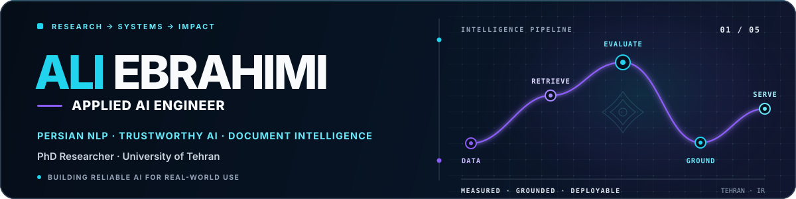

<div align="center">



### Applied AI Engineer · PhD Researcher · Persian NLP & Trustworthy AI

I build measurable, dependable AI systems—from research and evaluation to APIs and deployment.

[](https://www.linkedin.com/in/ali-ebrahimi-264236241/)


</div>

## What I do

| Research | Engineering | Focus |
|---|---|---|
| PhD candidate in Electrical Engineering — Electronics at the University of Tehran | Retrieval systems, model evaluation, REST APIs, model serving, safeguards, and containerized applications | Persian NLP, trustworthy LLM applications, document intelligence, and healthcare AI |

My work connects rigorous experimentation with usable software. I care about grounded answers, measurable evaluation, clear failure modes, and systems that can move beyond a notebook.

## Selected outcomes

| Area | Evidence |
|---|---|
| **Persian entailment** | Qwen2.5-14B achieved **62.69% accuracy** on ParsiNLU entailment |
| **Persian reasoning** | Qwen2.5-14B achieved **43.00% accuracy** on the Khayyam benchmark |
| **Reliable RAG** | Built a Persian evidence-grounded assistant with retrieval confidence checks, rejection, and safe fallbacks |
| **Document intelligence** | Developed a quality-aware Persian PDF pipeline that chooses between native extraction and OCR |

## Featured work

| Project | Why it matters | Stack |
|---|---|---|
| **[Persian User RAG Chatbot](https://github.com/ali-ebrahimii/User-RAG-ChatBot)** | Produces evidence-grounded Persian answers with normalization, confidence checks, and safe fallbacks | Python · FastAPI · Qwen · vLLM · FAISS · Streamlit |
| **[Persian LLM Benchmark](https://github.com/ali-ebrahimii/Test-Qwen2.5-7B-and-14B-Llama-3.1-8B-on-Khayyam-challenge-and-ParsiNLu-Entailment)** | Reproducibly compares open models across Persian reasoning, entailment, and sentiment tasks | Transformers · Jupyter · ParsiNLU · 4-bit quantization |
| **[Persian PDF Text Extraction](https://github.com/ali-ebrahimii/Persian-PDF-Text-Extraction-Pypdf2-OCR)** | Routes documents through native extraction or Persian/English OCR based on text quality | PyPDF2 · Tesseract · pdf2image · multiprocessing |
| **[Doctor's Assistant API](https://github.com/ali-ebrahimii/ChatGPT-API-Doctor-Assistance)** | Creates structured Persian clinical summaries with validation, retries, and safety constraints | FastAPI · Pydantic · OpenAI-compatible APIs · Docker |

## Technical toolkit

| AI systems | Backend & serving | Data & applied domains |
|---|---|---|
| LLM integration and evaluation · RAG · embeddings · vector search · structured outputs · prompt and guardrail design | Python · FastAPI · Pydantic · REST APIs · vLLM · Streamlit · Django · Docker | PyTorch · TensorFlow · Transformers · scikit-learn · pandas · NumPy · FAISS · SQL · Persian NLP · OCR · healthcare AI |

## How I build

```text
Understand the problem → prepare trustworthy data → establish a measurable baseline
→ design the AI workflow → expose a usable interface → test failure modes
→ add safeguards → prepare for deployment
```

## Currently exploring

- Reliable RAG and agentic workflows for Persian-language products
- Efficient evaluation and serving of multilingual open-weight models
- Structured LLM outputs and safety controls for healthcare workflows
- OCR, extraction, and retrieval across Persian document collections

<div align="center">

### Let’s build useful, trustworthy AI

Open to Applied AI, Machine Learning, NLP engineering, and research collaborations.  
[Connect with me on LinkedIn](https://www.linkedin.com/in/ali-ebrahimi-264236241/)

</div>
